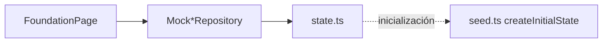

# Milestone 1 — WM1: Fundación, diseño y capa mock

> **Plantilla de documentación de milestones web.**  
> Cada milestone futuro puede replicar esta estructura: contexto → decisiones → entregables → flujo → verificación → pendientes.

| Campo | Valor |
|---|---|
| **ID plan** | WM1 |
| **Estado** | Completado |
| **Fecha** | 2026-08-27 |
| **Referencia** | [`docs/plans_web/plan-001.md`](../../plans_web/plan-001.md) § WM1 |
| **Alcance** | Solo frontend (`apps/web`). Sin backend, sin pantallas de negocio. |
| **Siguiente** | WM2 — Login, shell por rol, guards |

---

## 1. Objetivo

Construir la **base ejecutable** del prototipo SoloCamiones: design system, contratos TypeScript, dataset mock completo y arquitectura preparada para sustituir mocks por HTTP con cambios mínimos en milestones posteriores.

WM1 no entrega flujos de negocio visibles al usuario final. Entrega la **infraestructura frontend** sobre la que se apilarán WM2–WM12.

---

## 2. Contexto previo

Antes de WM1, `apps/web` era un scaffold mínimo:

- React 19 + Vite + TypeScript
- Una sola pantalla (`App.tsx`) con health check contra `/api/health/live`
- Sin Tailwind, sin routing, sin carpetas por feature
- Sin datos mock ni contratos de dominio

El plan web ([`plan-001.md`](../../plans_web/plan-001.md)) define 12 milestones. WM1 es prerequisito de todos los demás.

---

## 3. Decisiones clave y por qué

### 3.1 Arquitectura mock → API (patrón repositorio)

**Decisión:** Los componentes React nunca importan `seed.ts` ni contienen reglas de negocio. Solo consumen **interfaces de repositorio**; la implementación actual es in-memory (`Mock*Repository`), la futura será HTTP (`Http*Repository` en WM12).

**Por qué:**

- El plan exige que el prototipo Figma sea referencia de diseño, no de implementación. El Make concentra todo en `store.tsx`; aquí se corrige ese antipatrón desde el inicio.
- Cuando existan endpoints reales (p. ej. M10/M11 del plan API), solo se cambia la implementación del repositorio, no las pantallas.
- Facilita tests y separación de responsabilidades: UI orquesta, servicios validan, repositorios persisten.

```
Componentes → hooks (futuro) → Repository interface → MockRepository | HttpRepository
```

### 3.2 Contratos en `api/contracts/`

**Decisión:** Tipos de dominio (`entities.ts`) e interfaces de repositorio (`repositories.ts`) viven en `api/contracts/`, no en `mocks/`.

**Por qué:**

- Esos tipos representan el **contrato futuro con el backend**, no detalle de implementación mock.
- `mocks/` queda como capa intercambiable; `api/` como frontera estable del frontend hacia el servidor.

### 3.3 `Result<T, AppError>` para operaciones mock

**Decisión:** Los repositorios y servicios mock devuelven `Result<T, AppError>` en lugar de lanzar excepciones o usar booleans.

**Por qué:**

- El plan pide errores tipados con mensajes en español, no toasts genéricos.
- Modela explícitamente éxito/fallo — útil para login (WM2), confirmación de venta (WM8), claim de OT (WM10), etc.
- Es compatible con un futuro wrapper HTTP que mapee códigos de error del API.

### 3.4 Tailwind CSS v4 con tokens en `@theme`

**Decisión:** Tailwind v4 via plugin `@tailwindcss/vite`, tokens SoloCamiones definidos en `src/index.css` con `@theme`.

**Por qué:**

- v4 es el stack acordado en el plan; integración nativa con Vite sin PostCSS config separado.
- Tokens centralizados (`navy`, `brand`, `amber`, fuentes Inter/JetBrains Mono) garantizan consistencia visual desde WM1.
- Los componentes usan clases semánticas (`text-navy`, `bg-brand`) en lugar de hex hardcodeados.

### 3.5 Seed en `createInitialState()` — 4 usuarios, no 5

**Decisión:** Función pura `createInitialState(): AppState` en `mocks/data/seed.ts`; estado mutable en `mocks/state.ts`.

**Por qué:**

- El plan corrige el prototipo Figma: exactamente **4 usuarios seed** (1 Admin, 1 Vendedor, 2 Mecánicos), contraseña `demo1234`.
- Separar `seed.ts` (datos iniciales inmutables) de `state.ts` (estado de sesión demo que mutará en WM2+) permite reset de demo en WM12 sin reimportar features.
- `FoundationPage` demuestra que el seed carga **vía repositorios**, cumpliendo el criterio de no import directo.

### 3.6 `policies.ts` esqueleto sin lógica completa

**Decisión:** Función `can(user, action, context)` con matriz parcial; Admin allow-all, Seller/Mechanic con subset.

**Por qué:**

- WM1 solo necesita el **hook arquitectónico**. La matriz completa y guards de ruta se implementan en WM2.
- Los servicios mock de WM2+ deben llamar `can()` antes de mutar — establecer la firma ahora evita refactor después.

### 3.7 React Router desde WM1

**Decisión:** Router configurado en `router.tsx` aunque solo hay una ruta de verificación.

**Por qué:**

- WM2 añade `/login`, shell, redirects por rol — mejor no reestructurar `main.tsx` en el siguiente milestone.
- `App.tsx` queda como provider de toasts + `RouterProvider`.

### 3.8 `MechanicWorkOrderView` en contratos

**Decisión:** Tipo de proyección sin campos comerciales definido en `entities.ts`; `MockWorkOrderRepository.listForMechanic()` ya lo usa.

**Por qué:**

- Endurecimiento vs. Figma: el mecánico no debe ver costos aunque la UI los oculte. La proyección vive en el repositorio, no solo en CSS.
- WM10 implementará la app móvil; el contrato ya está listo.

---

## 4. Dependencias añadidas

| Paquete | Tipo | Propósito |
|---|---|---|
| `tailwindcss` + `@tailwindcss/vite` | dev | Design system v4 |
| `react-router-dom` | dep | Routing SPA |
| `@fontsource/inter` | dep | Tipografía UI |
| `@fontsource/jetbrains-mono` | dep | IDs, códigos, montos tabulares |

Sin librerías de estado global (Redux, Zustand). El plan prefiere estado local + repositorios hasta que sea necesario.

---

## 5. Estructura de carpetas creada

```
apps/web/src/
├── index.css                 # Tailwind v4 + tokens de marca SoloCamiones
├── main.tsx                  # Entry: fuentes, StrictMode, CSS
├── App.tsx                   # ToastProvider + RouterProvider
├── router.tsx                # Rutas (placeholder WM1)
│
├── api/
│   ├── contracts/
│   │   ├── entities.ts       # User, Item, Invoice, WorkOrder, AppState, …
│   │   ├── repositories.ts   # AuthRepository, InventoryRepository, …
│   │   └── index.ts
│   └── client/
│       └── http-client.ts    # Stub fetch + flag VITE_USE_MOCK_API
│
├── mocks/
│   ├── data/
│   │   └── seed.ts           # createInitialState()
│   ├── state.ts              # getMockState / resetMockState
│   └── repositories/
│       ├── MockAuthRepository.ts
│       ├── MockInventoryRepository.ts
│       ├── MockCustomerRepository.ts
│       ├── MockSalesRepository.ts
│       ├── MockWorkOrderRepository.ts
│       ├── MockCategoryRepository.ts
│       ├── MockServiceRepository.ts
│       ├── MockUserRepository.ts
│       ├── MockEventRepository.ts
│       └── index.ts
│
├── shared/
│   ├── auth/
│   │   ├── types.ts          # AppError, Result<T>, ok(), err()
│   │   └── policies.ts       # can() skeleton
│   ├── ui/                   # Design system base
│   │   ├── Button, Card, Chip, Modal, Field, Input, Select, Textarea
│   │   ├── Info, Empty, Toaster, SectionTitle, Mono, money.ts
│   │   └── index.ts
│   └── layout/
│       └── AppLayout.tsx     # Shell vacío (sidebar en WM2)
│
└── features/
    └── foundation/
        └── FoundationPage.tsx  # Página de verificación WM1
```

**Convención para milestones futuros:** cada feature nueva va en `features/<nombre>/` con sus páginas, hooks y componentes específicos. Lo reutilizable sube a `shared/`.

---

## 6. Entregables detallados

### 6.1 Design system (`shared/ui/`)

| Componente | Responsabilidad |
|---|---|
| `Button` | Variantes primary/secondary/ghost/danger, tamaños sm/md/lg |
| `Card` | Contenedor con borde y padding configurable |
| `Chip` | Etiquetas de estado (neutral, brand, amber, success, danger) |
| `Field` + `Input` + `Select` + `Textarea` | Formularios accesibles con label, hint, error |
| `Modal` | Diálogo modal básico |
| `Info` | Alertas informativas (info, warning, success, error) |
| `Empty` | Estado vacío con título, descripción y acción opcional |
| `Toaster` + `useToast` | Notificaciones temporales |
| `SectionTitle` | Título de sección con subtítulo y acción |
| `Mono` | Texto monoespaciado (IDs, códigos) |
| `money()` | Formateo DOP/USD con `Intl.NumberFormat` |

Los chips de dominio (`CommercialChip`, `InvoiceStatusChip`, etc.) se añaden en milestones de inventario/ventas (WM5–WM7).

### 6.2 Contratos de dominio (`api/contracts/entities.ts`)

Entidades modeladas:

- `User`, `Session`, `Role`
- `Item`, `KnownMissingComponent`, `QtyProduct`
- `Customer`, `Category`, `Service`
- `Invoice`, `InvoiceLine`, `Payment`
- `WorkOrder`, `MechanicWorkOrderView`
- `AppEvent`, `AppState`

Enums alineados con la documentación de producto (`AVAILABLE`/`SOLD`, `DRAFT`/`COMPLETED`/`CANCELLED`, etc.).

### 6.3 Interfaces de repositorio (`api/contracts/repositories.ts`)

| Repositorio | Métodos (WM1) | Implementación futura |
|---|---|---|
| `AuthRepository` | login, logout, getSession, getCurrentUser | WM2 mock → M10 HTTP |
| `UserRepository` | list, getById, save | WM11 |
| `InventoryRepository` | listItems, getItem, listQtyProducts, getQtyProduct | WM5–WM6 |
| `CustomerRepository` | list, search, getById, save | WM4 |
| `SalesRepository` | listInvoices, getInvoice | WM7–WM8 |
| `WorkOrderRepository` | list, getById, listForMechanic | WM9–WM10 |
| `CategoryRepository` | list, save | WM11 |
| `ServiceRepository` | list, save | WM11 |
| `EventRepository` | list | WM3+ |

En WM1 los `Mock*Repository` implementan lectura básica; mutaciones y auth quedan como stubs o `NOT_FOUND`.

### 6.4 Dataset seed (`createInitialState()`)

Contenido alineado con el plan y `USE_CASE_FLOWS.md`:

| Entidad | Cantidad | Notas |
|---|---|---|
| Usuarios | 4 | `admin`, `laura`, `carlos`, `pedro` — pwd `demo1234` |
| Ítems | 9 | Jerarquía CAM-001 → MOT-001/002/003 + piezas |
| Known missing | 1 | Turbo faltante en MOT-002 |
| Productos cantidad | 2 | Aceite, filtro de aire |
| Clientes | 3 | C0 Cliente Contado (default), C1, C2 |
| Categorías | 7 | Camión, Motor, Alternador, Turbo, … |
| Servicios | 3 | 2 activos, 1 inactivo |
| Facturas | 5 | 1 borrador + FAC-096/097/098/099 |
| Órdenes de trabajo | 4 | OD-DEMO-060 asignada a `pedro` (In Progress) |
| Eventos | 3 | Confirmación, claim OT, pago parcial |
| Meta | — | `fxAvailable: false`, `facSeq: 100`, tasa 61.50 |

Casos de demo preparados para milestones posteriores:

- **MOT-003:** `noDesarmar: true` → WM5/WM8
- **FAC-000096:** USD, `profitabilityPendingFx: true` → WM12
- **FAC-000098:** sin pagar → WM7
- **FAC-000099:** pago parcial → WM7
- **OD-DEMO-060:** In Progress, Pedro → WM10

### 6.5 Página de verificación (`FoundationPage`)

Ruta `/` — demuestra:

1. Tokens SoloCamiones aplicados (navy, brand, amber)
2. Componentes del design system interactivos (chips, botones, toast)
3. Conteos del seed cargados **vía repositorios mock** (no import de `seed.ts`)
4. Mensaje arquitectónico sobre `VITE_USE_MOCK_API`

Esta página se reemplazará o redirigirá en WM2 cuando exista `/login`.

---

## 7. Flujo de datos (WM1)



Reglas vigentes:

- `features/*` → solo `mocks/repositories` o (futuro) factories que elijan mock vs HTTP
- `mocks/repositories` → `mocks/state.ts`
- `mocks/state.ts` → `mocks/data/seed.ts` (solo en init/reset)
- `mocks/data/seed.ts` → **nadie más importa este archivo**

---

## 8. Criterios de aceptación

| Criterio | Estado |
|---|---|
| `npm run dev` muestra UI con tokens SoloCamiones | ✅ |
| Seed carga sin errores; `npm run typecheck` pasa | ✅ |
| Ningún feature importa `seed.ts` directamente | ✅ |
| Ningún componente contiene reglas de negocio | ✅ |
| Plan refleja convención mock→API | ✅ |

---

## 9. Verificación

```bash
# Desde la raíz del monorepo
npm run typecheck -w @solocamiones/web

# O desde apps/web
cd apps/web
npm run dev        # http://localhost:5173
npm run typecheck
npm run build
```

**Qué observar en el navegador:**

- Título "WM1 — Fundación" con marca SoloCamiones
- Paleta navy/brand/amber visible en chips y botones
- Panel "Seed mock" con conteos: users 4, items 9, qtyProducts 2, customers 3, invoices 5, workOrders 4
- Botón "Probar toast" muestra notificación

---

## 10. Explícitamente fuera de alcance (WM1)

| Tema | Milestone responsable |
|---|---|
| Login, sesión, logout | WM2 |
| Shell con sidebar por rol | WM2 |
| `ProtectedRoute`, guards UX | WM2 |
| Matriz completa de `policies.ts` | WM2 |
| Pantallas Dashboard, Inventario, Ventas, … | WM3–WM12 |
| Servicios mock con lógica de negocio | WM2+ (por dominio) |
| `mocks/services/` | WM5+ |
| Escenarios demo (12) | WM12 |
| `Http*Repository` | WM12 |
| Tests E2E | Recomendados desde WM7 |

---

## 11. Pendientes y handoff a WM2

WM2 debe construir sobre estos puntos sin reescribir WM1:

1. **`MockAuthRepository`** — implementar login/logout/getSession con estado de sesión en memoria
2. **`AppLayout`** — añadir sidebar (9 ítems Admin / 4 Vendedor), header, user menu
3. **`router.tsx`** — rutas `/login`, redirects por rol, `/mechanic/*`
4. **`policies.ts`** — completar matriz según [`ROLES_AND_PERMISSIONS.md`](../../ROLES_AND_PERMISSIONS.md)
5. **Features `auth/`** — `LoginPage`, `LoginForm`, `DemoCredentialsPanel`
6. **Eliminar o redirigir** `FoundationPage` una vez verificado WM2

Archivos que WM2 tocará con más probabilidad:

- `mocks/repositories/MockAuthRepository.ts`
- `shared/layout/AppLayout.tsx`
- `shared/auth/policies.ts`
- `router.tsx`
- Nuevo: `features/auth/*`, `shared/layout/ProtectedRoute.tsx`

---

## 12. Plantilla para milestones futuros

Al documentar WM2, WM3, … replicar estas secciones:

1. **Metadatos** — ID, estado, fecha, referencia al plan
2. **Objetivo** — qué problema resuelve este milestone
3. **Contexto previo** — qué existía antes (enlace al milestone anterior)
4. **Decisiones clave** — qué se eligió y por qué (con alternativas descartadas si aplica)
5. **Dependencias** — paquetes nuevos, si los hay
6. **Estructura / archivos** — árbol o tabla de lo creado/modificado
7. **Entregables detallados** — componentes, servicios, datos
8. **Flujo** — diagrama de cómo conecta con capas existentes
9. **Criterios de aceptación** — checklist del plan
10. **Verificación** — comandos y qué observar
11. **Fuera de alcance** — qué NO se hizo a propósito
12. **Handoff** — qué deja listo para el siguiente milestone

---

## 13. Referencias consultadas

- [`docs/plans_web/plan-001.md`](../../plans_web/plan-001.md) — alcance WM1, decisiones cerradas, arquitectura
- [`docs/ARCHITECTURE_PLAN.md`](../../ARCHITECTURE_PLAN.md) — dirección frontend SPA
- [`docs/PROTOTYPE_PLAN.md`](../../PROTOTYPE_PLAN.md) — intención UX (no implementación)
- [`docs/ROLES_AND_PERMISSIONS.md`](../../ROLES_AND_PERMISSIONS.md) — base para `policies.ts`
- [`docs/USE_CASE_FLOWS.md`](../../USE_CASE_FLOWS.md) — estados de dominio y ejemplos MOT-001/002
