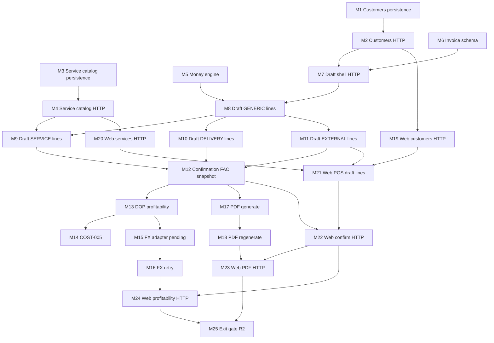

# Plan Release 2 — Billing Core: Customers, Invoices, Cost/Profit, PDF

**Release:** 2 — Billing Core  
**Estado:** **COMPLETADO en local** (M1–M25; exit gate 2026-09-11)  
**Último milestone:** Milestone 25 — Exit gate Release 2  
**Registro de implementación:** [`../done_api/release_2.md`](../done_api/release_2.md)  
**Trabajo adelantado:** el slice financiero de Release 3 (pagos, CxC, cancelación no-inventario) **ya está en el código**. Ver [`../done_api/release_3.md`](../done_api/release_3.md) y el snapshot en [`../DEVELOPMENT_PLAN.md`](../DEVELOPMENT_PLAN.md). No volver a implementarlo en un plan R3 desde cero.

---

## Contexto

- **Release:** Release 2 — Billing Core ([`../DEVELOPMENT_PLAN.md`](../DEVELOPMENT_PLAN.md) §Release 2).
- **Release 1:** COMPLETADO. M1–M11 verificados en local (exit gate de navegador 2026-09-07) y M4 cerrado en GitHub (`CI R1` / check `R1 quality`). Ver [`plan-001.md`](plan-001.md) y [`../done_api/release-1.md`](../done_api/release-1.md).
- **Entorno:** desarrollo y pruebas **únicamente en local** durante este plan. El primer despliegue productivo es un gate operativo **después** de completar Billing Core; no es un milestone de este archivo ([`../DEVELOPMENT_PLAN.md`](../DEVELOPMENT_PLAN.md) §First production deployment).
- **Features en alcance:** [`../FEATURES/08_CUSTOMERS.md`](../FEATURES/08_CUSTOMERS.md), slice R2 de [`../FEATURES/10_SALES_AND_INVOICES.md`](../FEATURES/10_SALES_AND_INVOICES.md), slice R2 de [`../FEATURES/11_COST_AND_PROFITABILITY.md`](../FEATURES/11_COST_AND_PROFITABILITY.md), slice de history de [`../FEATURES/14_HISTORY_ADMIN_AND_RECOVERY.md`](../FEATURES/14_HISTORY_ADMIN_AND_RECOVERY.md). Permisos: [`../FEATURES/01_ACCESS_AND_USERS.md`](../FEATURES/01_ACCESS_AND_USERS.md) y [`../ROLES_AND_PERMISSIONS.md`](../ROLES_AND_PERMISSIONS.md).
- **Frontend:** el prototipo mock de [`../plans_web/plan-001.md`](../plans_web/plan-001.md) está cerrado (WM12). Access/Users, clientes, catálogo de servicios, POS draft, confirmación, PDF, **pagos, CxC, cancelación no-inventario y rentabilidad** usan HTTP cuando `VITE_USE_MOCK_API` no es `true`. El detalle de factura HTTP muestra **actividad de documento** (Feature 14).
- **Estado API de partida:** Auth, `requireAuth`/`requireRole`, usuarios, envelope de history (`HistoryEvent`) y convención `routes → controller → service → repository → validation → types` están listos. M1–M4 cubren clientes y catálogo de servicios (persistencia + HTTP). M5 es el motor decimal de ITBIS. M6 persiste el agregado Invoice/`FAC-`. M7 expone la cáscara HTTP de draft. M8 añade líneas GENERIC y rechaza ITEM/QTY. M9 añade líneas SERVICE de catálogo activo (precio en la línea). M10 añade líneas DELIVERY (descripción obligatoria; máximo una; `0` o positivo; no gravada). M11 añade líneas EXTERNAL gravadas con costo DOP. M12 confirma el draft: `FAC-`, snapshot de cliente y dinero congelado. M13 deriva profit DOP sobre ese snapshot y lo proyecta solo a Administrator. M14 registra profit DOP juzgado (COST-005) cuando el costo es desconocido. M15 enriquece USD con ExchangeRate-API o deja `PENDING_FX_RATE` sin abortar la venta. M16 reintenta la tasa histórica del día de confirmación. M17 genera el PDF interno tras confirmar (sin bytes persistidos) o deja `FAILED` + `errorId`. M18 regenera un PDF `FAILED` (solo Administrator) sin reabrir la venta.
- **Ciclo por milestone:** plan → implementación → pruebas → revisión → commit. La integración web se hace **solo** cuando la función API cumple el criterio de la sección Integración API → Web.

## Cómo se cortan los milestones

La idea es el corte más pequeño que sigue siendo un commit releasable, sin dejar el sistema a medias.

**Sí se parte** cuando el segundo corte no depende de terminar el primero en la misma transacción HTTP:

- persistencia (Prisma + repository + tests) vs HTTP;
- motor de dinero puro vs esquema de factura;
- cáscara de draft vs cada tipo de línea;
- cálculo DOP vs comando COST-005;
- adaptador FX + pending vs retry;
- generar PDF vs regenerar;
- cada swap web de un repositorio distinto.

**No se parte** cuando hacerlo rompería un invariante:

- history va en la **misma transacción** que la escritura (no hay milestone “solo eventos”);
- confirmación = lock `FAC-` + snapshot + `Completed` en **una** transacción (no hay milestone que asigne número sin confirmar);
- el POS web cablea las cuatro líneas juntas: mezclar líneas HTTP con líneas mock en la misma pantalla causa estados imposibles.

## Alcance total de Release 2

| Incluido | Excluido / ya no aplica como “futuro” |
|---|---|
| Clientes: search/create/edit, contactos, `Cliente contado`, validación fiscal, snapshot inmutable al confirmar | Categorías de inventario / atributos (Release 4) |
| Catálogo de servicios mecánicos (Administrator mantiene; Seller usa) | Líneas de inventario individual o cantidad; reservas (Release 5) — API las rechaza con 409 |
| Ciclo Draft → Completed; estado `Cancelled` en el dominio | Venta instalada / ensamblaje (Release 7) |
| **Pagos, CxC básica y cancelación no-inventario:** adelantados (Release 3); ver `done_api/release_3.md`. `confirmInvoice` **puede** registrar pago inicial | Aging, límites de crédito, CxP (3B), corrección de moneda INV-006 (Release 8) |
| Moneda única DOP o USD por factura; secuencia compartida `FAC-` nunca reusada | DGII / generación o validación de NCF / e-CF |
| Líneas: genérica, servicio de catálogo, entrega, reventa externa | Object storage / fotos (Release 4+) |
| ITBIS 18 % incluido en mercancía gravada; servicio y entrega no gravados | Dashboard KPIs reales; staging, producción, hosting, HTTPS productivo, backups |
| PDF interno regenerable con `NCF: ______________________` en blanco | |
| Costo DOP actual/estimado/desconocido; rentabilidad Administrator-only **API + UI HTTP** (M24); COST-005; FX USD + retry. | |
| History de clientes, catálogo de servicios, draft, confirmación, PDF, rentabilidad, **pagos y cancelación** | Recovery operacional / diagnósticos (Release 8) |

## Decisiones cerradas (fuente de verdad)

Documentadas en los feature specs, [`../DEVELOPMENT_PLAN.md`](../DEVELOPMENT_PLAN.md), [`../ARCHITECTURE_PLAN.md`](../ARCHITECTURE_PLAN.md) y [`../ROLES_AND_PERMISSIONS.md`](../ROLES_AND_PERMISSIONS.md). Decisiones de este plan (2026-09-07):

1. Este archivo cubre **API + integración web**, igual que Release 1.
2. R2 incluye **reventa externa (LINE-005)** y **rentabilidad USD/FX (COST-003 + retry)**.
3. Confirmación es el evento comercial. El plan original no incluía pagos en R2; **el owner adelantó Release 3**: `confirmInvoice` puede registrar un pago inicial y `dueDate`. Pagos adicionales usan `POST /api/sales/:id/payments`.
4. El estado `Cancelled` existe en el modelo. **El comando de cancelar no-inventario ya está implementado** (`POST /api/sales/:id/cancel`, solo Administrator). Restauración de inventario/OT sigue Release 5/7.
5. Líneas ITEM/QTY se modelan en el discriminador para **rechazarlas** con error explícito, no para habilitarlas.
6. Dinero: aritmética decimal (Prisma `Decimal` / equivalente), nunca `number` flotante. Redondeo a dos decimales **por línea**; totales = suma de líneas ya redondeadas.
7. ITBIS 18 % **incluido** en el precio final de mercancía gravada (genérica y reventa externa). Servicio y entrega no gravados. Entrega gratuita usa `0` numérico, nunca texto.
8. `Cliente contado` es identidad genérica estable; no satisface RNC/Cédula fiscal.
9. Teléfono y email viven en **contactos** del cliente, no en el registro del cliente. Los contactos pueden estar vacíos (`Cliente contado`).
10. Snapshot de cliente y de líneas al confirmar: editar el cliente reutilizable no cambia facturas completadas.
11. PDF se genera **fuera** de la transacción de confirmación. Un fallo de PDF no invalida ni duplica la venta. Administrator regenera desde hechos inmutables. Sin S3 en R2.
12. FX es un adaptador de infrastructure. El proveedor concreto es **[ExchangeRate-API](https://www.exchangerate-api.com/)** (API v6). La clave vive solo en env (p. ej. `EXCHANGE_RATE_API_KEY`); nunca en el código. Un test double es obligatorio. Falta de tasa, timeout, clave inválida o cuota agotada: la factura USD se confirma y la rentabilidad queda `UNAVAILABLE / PENDING FX RATE`.
13. COST-005 (profit DOP juzgado) solo si el costo es desconocido. No pisa estimado ni pending FX.
14. Seller ve costo de adquisición; solo Administrator ve profit/margen/estadísticas. Mechanic no ve clientes, facturas, precios, costos ni profit.
15. History: el envelope de R1 se reutiliza. Cada escritura de negocio **relevante** appende eventos en la **misma transacción**. El detalle de factura HTTP proyecta actividad de documento (confirmación, pago, PDF, anulación; profit/FX solo Administrator). Owner: no append ni mostrar en esa UI `INVOICE_DRAFT_UPDATED` ni `INVOICE_LINE_ADDED` / `UPDATED` / `REMOVED`. No hay pantalla de administración de historial en R2.
16. Hosting / RPO / RTO / HTTPS productivo **no bloquean** M1–M25. Bloquean el primer uso en producción, no este plan local.

## Integración API → Web (cuándo cablear)

El prototipo web ya tiene pantallas de clientes, POS, facturas, servicios y rentabilidad. El cuello de botella es la API, no la UI.

**Una función está lista para integrar** cuando se cumplen los tres lados:

| Lado | Listo cuando |
|---|---|
| API | Módulo con routes, controller, service, repository, validation, types; tests de la función; errores HTTP estables (R1 M3) |
| Web | Pantalla/flujo + interfaz de repositorio + stub HTTP en `apps/web/src/api/` (WM4/WM8/WM12 para customers, sales, services, profitability) |
| Alcance de release | La función pertenece a Release 2. Tener UI mock de un release posterior **no** autoriza a integrar esa API ahora ([`../DEVELOPMENT_PLAN.md`](../DEVELOPMENT_PLAN.md) §1.7) |

Hasta el swap de cada función: `VITE_USE_MOCK_API` distinto de `false` para ese repositorio. No mezclar clientes reales con facturas mock, ni al revés.

Access/Users permanece en HTTP. Inventario, pagos, cancelación, OT, dashboard KPIs y recovery **siguen no implementados** en HTTP.

### Matriz Release 2 — primer momento integrable

| Función | Componentes API | Componentes web (ya existen) | Primer momento integrable | Trabajo de integración |
|---|---|---|---|---|
| Clientes search/create/edit | M1–M2 | `CustomerRepository`, `/customers`, selector en POS | **Después de M2**; swap en **M19** | `HttpCustomerRepository` / `customers-api.ts` |
| Catálogo de servicios | M3–M4 | `ServiceRepository`, UI de catálogos | **Después de M4**; swap en **M20** | `HttpServiceRepository`. No abrir categorías de inventario |
| Motor de cálculo | M5 | — | Nunca a UI solo | Unit tests. El POS espera líneas HTTP |
| Esquema factura / secuencia `FAC-` | M6 | — | Nunca a UI solo | Persistencia. Draft HTTP espera M7 |
| Draft cáscara (meta, moneda, cliente) | M7 | create/get/meta/discard | **Después de M7**; swap en **M21** junto con líneas | No cablear POS hasta M8–M11 |
| Línea GENERIC + rechazo ITEM/QTY | M8 | `addLine` / `removeLine` / `setLinePrice` | **Después de M11** (las cuatro líneas); swap en **M21** | Un solo swap POS; no mezclar tipos HTTP y mock |
| Línea SERVICE | M9 | idem | después de M11 | incluido en M21 |
| Línea DELIVERY | M10 | idem | después de M11 | incluido en M21 |
| Línea EXTERNAL + costo | M11 | idem | después de M11 | incluido en M21 |
| Confirmación + `FAC-` + snapshot | M12 | `confirmInvoice` | **Después de M12**; swap en **M22** | Plan original: sin pago. **Hoy:** pago inicial opcional (R3 adelantado) |
| Rentabilidad DOP | M13 | panel admin | **Después de M13**; swap en **M24** | Proyección Administrator-only |
| COST-005 | M14 | `recordManualGrossProfit` | **Después de M14**; swap en **M24** | Mismo repositorio de rentabilidad |
| FX pending | M15 | pending FX | **Después de M15**; swap en **M24** | Confirmación USD ya existe en M12 |
| FX retry | M16 | retry USD | **Después de M16**; swap en **M24** | |
| PDF generar | M17 | preview/print | **Después de M17**; swap en **M23** | Fallo no revierte la venta |
| PDF regenerar | M18 | regenerate | **Después de M18**; swap en **M23** | Administrator |
| Pagos, cancelar, corregir moneda, inventario | — | mocks del prototipo | **No en R2** | Capabilities `payments`, `invoiceCancellation`, `inventory*` off en HTTP R2 |

### Qué hacer después de cada milestone

| Al terminar | Integrar a web | No integrar todavía |
|---|---|---|
| **M1** | Nada (no hay HTTP) | Customers HTTP |
| **M2** | Clientes **quedan integrables**. Swap **M19** | POS/facturas |
| **M3** | Nada (no hay HTTP) | Servicios HTTP |
| **M4** | Servicios **quedan integrables**. Swap **M20** | Categorías de inventario (R4) |
| **M5** | Nada de UI | Draft |
| **M6** | Nada de UI | Draft HTTP |
| **M7–M11** | Draft **queda integrable** al cerrar **M11**. Swap **M21** | Confirmación, PDF, profit |
| **M12** | Confirmación **queda integrable**. Swap **M22** | PDF / profit |
| **M13–M16** | Profit **queda integrable** al cerrar **M16**. Swap **M24** | PDF si M17–M18 no están |
| **M17–M18** | PDF **queda integrable** al cerrar **M18**. Swap **M23** | Nada de R3+ |
| **M19** | Customers HTTP | POS si M11 no está |
| **M20** | Servicios HTTP | POS si M11 no está |
| **M21** | POS draft + líneas HTTP | Confirmación/PDF/profit |
| **M22** | Confirmación HTTP | PDF / profit |
| **M23** | PDF HTTP | Profit |
| **M24** | Rentabilidad HTTP | Exit gate |
| **M25** | Exit gate R2 | Rentabilidad HTTP (M24). Pagos/CxC **ya adelantados** (no son el “siguiente milestone” de este archivo) |

**Release 2 cerrado (local):** Access/Users + clientes + facturas no-inventario + PDF + rentabilidad hablan con API real. Pagos, inventario, OT y recovery permanecen mock/deshabilitados.

## Arquitectura de módulos API

Misma convención que R1:

```text
feature/
  routes
  controller
  service
  repository
  validation
  types
```

Módulos nuevos previstos:

| Módulo | Responsabilidad |
|---|---|
| `customers` | CUST-001..003: registros, contactos, `Cliente contado`, snapshot usado por sales |
| `catalogs` (servicios) | Catálogo de servicios mecánicos; categorías de inventario no entran |
| `sales` | Agregado factura, líneas, draft, confirmación, secuencia `FAC-` |
| `costs` / rentabilidad | COST-001..005 para líneas habilitadas; proyección Administrator-only |
| `invoice-documents` | PDF desde hechos inmutables; estado operativo de generación |

Adaptador FX: `apps/api/src/infrastructure/` (no es un módulo de ventas ni de conversión operativa). Implementación real: cliente HTTP a ExchangeRate-API. En tests, un double que no llama a la red.

Confirmación es el servicio coordinador: repositorios participantes comparten una transacción PostgreSQL. PDF y FX **no** forman parte de esa transacción comercial.

## Limitación crítica (no negociable)

Las facturas R2 **no** representan movimientos de inventario.

Una línea genérica o de reventa externa nunca debe:

- crear inventario local;
- reservar inventario local;
- decrementar cantidad;
- marcar un ítem tracked como Sold;
- cambiar jerarquía;
- crear un Work Order.

La UI no debe implicar sincronización de inventario para líneas no soportadas. Las acciones de inventario se rechazan con error de negocio explícito, no se aproximan.

## Diagrama de dependencias



Paralelo al inicio: M1 ∥ M3 ∥ M5 ∥ M6. M19 puede seguir a M2 sin esperar el resto. M20 puede seguir a M4. M9, M10 y M11 pueden ir en cualquier orden después de M8 (M9 espera también M4). M14 y M15 pueden seguir a M13 en paralelo.

## Milestones — estado

| ID | Milestone | Estado | Integración web |
|---|---|---|---|
| M1 | Customers persistencia + `Cliente contado` | completado | Ninguna |
| M2 | Customers HTTP (CUST-001/002) | completado | **Integrado en M19** |
| M3 | Catálogo de servicios persistencia | completado | Ninguna |
| M4 | Catálogo de servicios HTTP | completado | **Listo para M20** |
| M5 | Motor de cálculo ITBIS / redondeo | completado | Ninguna |
| M6 | Esquema Invoice / línea / secuencia `FAC-` | completado | Ninguna |
| M7 | Draft HTTP cáscara | completado | Swap POS en **M21** (con líneas) |
| M8 | Draft línea GENERIC + rechazo ITEM/QTY | completado | Swap POS en **M21** |
| M9 | Draft línea SERVICE | completado | Swap POS en **M21** |
| M10 | Draft línea DELIVERY | completado | Swap POS en **M21** |
| M11 | Draft línea EXTERNAL + costo | completado | **Listo para M21** |
| M12 | Confirmación + `FAC-` + snapshot | completado | **Listo para M22** |
| M13 | Rentabilidad DOP + frontera Admin | completado | Swap profit en **M24** |
| M14 | COST-005 profit juzgado | completado | Swap profit en **M24** |
| M15 | Adaptador FX ExchangeRate-API + pending | completado | Swap profit en **M24** |
| M16 | Retry FX Administrator | completado | **Listo para M24** |
| M17 | PDF generar + estado de fallo | completado | Swap PDF en **M23** |
| M18 | PDF regenerar Administrator | completado | **Listo para M23** |
| M19 | Web: customers HTTP | completado | Swap `CustomerRepository` |
| M20 | Web: catálogo de servicios HTTP | completado | Swap `ServiceRepository` |
| M21 | Web: POS draft + líneas soportadas | completado | Swap subset draft de sales |
| M22 | Web: confirmación HTTP | completado | Swap `confirmInvoice` |
| M23 | Web: PDF HTTP | completado | Print / regenerate |
| M24 | Web: rentabilidad HTTP | completado | Swap `ProfitabilityRepository` |
| M25 | Exit gate Release 2 | completado | Verificación end-to-end; sin features nuevas |

---

## Milestone 1 — Customers persistencia (CUST-001/002 datos)

**Objetivo:** Modelar clientes, contactos y `Cliente contado` en PostgreSQL, sin rutas HTTP.

**Alcance:**
- Prisma: `Customer` + `CustomerContact` (nombre, teléfono, email, título opcional). Teléfono/email en contactos, no en el cliente.
- Semilla estable de `Cliente contado` (identidad genérica; no puede satisfacer RNC/Cédula fiscal).
- `CustomerRepository`: create, find, search por nombre/RNC, update. Acepta cliente de transacción.
- Validación Zod reutilizable (sin Express): campos permitidos, rechazo de ajenos.
- Duplicados: no bloquear persona duplicada en no fiscal; conflicto de identificador fiscal sí.

**Pruebas:**
- Integration: CRUD, contactos vacíos en genérico, semilla presente tras migrate, rollback
- Unique/conflictos fiscales a nivel de persistencia

**Definición de terminado:**
- Migración aplicable en BD limpia. Sin HTTP de customers.

**Integración web:** Ninguna.

---

## Milestone 2 — Customers HTTP (CUST-001/002 API)

**Objetivo:** Exponer search/create/edit con autorización server-side e history.

**Alcance:**
- Módulo `customers` completo: routes → controller → service → repository.
- Seller/Administrator ALLOW; Mechanic 403.
- `requireAuth` + `requireRole`; CSRF en escrituras autenticadas.
- History `CUSTOMER_*` en la misma transacción que create/edit.
- Regla de `Cliente contado` vs fiscal expuesta para que M7/M12 la usen.

**Pruebas:**
- HTTP: search/create/edit, Mechanic 403, Seller/Admin 200
- Fallo → sin evento de éxito
- Validación 400 con envelope R1

**Definición de terminado:**
- API de clientes usable. Sin facturas.

**Integración web (después de M2):** Clientes **quedan integrables**. El swap es M19.

---

## Milestone 3 — Catálogo de servicios persistencia

**Objetivo:** Tabla de tipos de servicio mecánico, sin precio y sin HTTP.

**Alcance:**
- Prisma: identidad, nombre/descripción, activo/inactivo. **Sin** precio.
- Repository: create/update, listar todos (admin), listar activos (POS).
- Sin categorías de inventario (Release 4).

**Pruebas:**
- Integration: persistir activo/inactivo; listado de selección omite inactivos

**Definición de terminado:**
- Migración lista. Sin rutas.

**Integración web:** Ninguna.

---

## Milestone 4 — Catálogo de servicios HTTP (LINE-004 catalog / ADMIN-001 slice)

**Objetivo:** CRUD Administrator y lectura Seller de servicios activos.

**Alcance:**
- Admin create/edit/deactivate; Seller list/read de activos; Mechanic 403.
- History de mantenimiento en la misma transacción.
- El rechazo al agregar línea de servicio inactivo se cablea en M9; M4 deja la consulta.

**Nota de capabilities web:** [`apps/web/src/shared/config/capabilities.ts`](../../apps/web/src/shared/config/capabilities.ts) agrupa `catalogs` en Release 4. R2 necesita **solo servicios**. M20 habilita servicios sin categorías de inventario.

**Pruebas:**
- Admin escribe; Seller 403 en escritura y 200 en lectura de activos
- Mechanic 403

**Definición de terminado:**
- API de servicios usable. Precio sigue siendo campo de línea (M9).

**Integración web (después de M4):** Servicios **quedan integrables**. El swap es M20.

---

## Milestone 5 — Motor de cálculo ITBIS y redondeo (SALE-003)

**Objetivo:** Funciones puras decimal-safe, sin Prisma y sin HTTP.

**Alcance:**
- Mercancía genérica y reventa externa: ITBIS 18 % **incluido** (derivar base e impuesto; no sumar 18 % encima).
- Servicio y entrega: no gravados.
- Entrega omitida = sin línea; gratis = `0` numérico; cobrada = positivo.
- Cada línea se calcula y redondea a 2 decimales; el total es la suma de esas líneas.
- Desconocido ≠ cero (el profit espera M13; aquí el costo no se trata como 0).

**Pruebas:**
- Unit: gravado, no gravado, multi-línea vs redondeo único final, `0` de entrega, rechazos de importe negativo / no numérico

**Definición de terminado:**
- Motor cubierto por unit tests. Sin tablas de factura.

**Integración web:** Ninguna.

---

## Milestone 6 — Esquema Invoice, líneas y secuencia `FAC-`

**Objetivo:** Persistencia del agregado y de la fila de secuencia, sin draft HTTP.

**Alcance:**
- Prisma: `Invoice`, `InvoiceLine`, secuencia compartida `FAC-` (fila con lock previsto, patrón `facSeq` de architecture).
- Estados: `Draft`, `Completed`, `Cancelled` (enum; **sin** comando cancel).
- Una moneda por factura: `DOP` o `USD`.
- Discriminador de línea: GENERIC, SERVICE, DELIVERY, EXTERNAL, e ITEM/QTY para **rechazar** después, no para vender inventario.
- Draft no tiene número `FAC-`. Asignación solo en M12.
- Repositories de invoice/línea/secuencia sin rutas de ventas.

**Pruebas:**
- Integration: insertar draft sin `FAC-`; constraint de moneda; secuencia existe
- Tests de lock/next-number **aislados** pueden vivir aquí o en M12; no confirmar ventas todavía

**Definición de terminado:**
- Migración aplicable. Sin HTTP de sales.

**Integración web:** Ninguna.

---

## Milestone 7 — Draft HTTP cáscara (SALE-001 draft sin líneas)

**Objetivo:** Crear, leer, ajustar meta y descartar un draft, todavía sin líneas.

**Alcance:**
- Crear draft (Seller/Administrator); moneda DOP o USD editable; cliente o `Cliente contado`; flag fiscal/no fiscal.
- `Cliente contado` solo en no fiscal; fiscal exige RNC/Cédula.
- Listar/obtener; descartar; Mechanic 403.
- History de creación/edición de meta y de moneda de draft.
- Sin `FAC-`. Sin addLine.

**Pruebas:**
- HTTP: crear, cambiar moneda, asignar cliente, fiscal + contado → conflicto, discard
- Mechanic 403

**Definición de terminado:**
- Cáscara usable. POS web espera M8–M11.

**Integración web:** No cablear POS todavía.

---

## Milestone 8 — Draft línea GENERIC + rechazo ITEM/QTY (LINE-003)

**Objetivo:** Infraestructura `addLine` / `removeLine` / `setLinePrice` con mercancía genérica gravada, y rechazo explícito de inventario.

**Alcance:**
- Línea GENERIC: descripción, cantidad si aplica, precio final, costo DOP actual/estimado/desconocido.
- Recalcular con el motor de M5 en cada mutación.
- Rechazar ITEM/QTY y cualquier acción de inventario/reserva/WO/jerarquía.
- Rechazar precios negativos y placeholders textuales.
- Desconocido nunca se guarda como 0.

**Pruebas:**
- HTTP: agregar/quitar/precio GENERIC; totales gravados
- ITEM/QTY → error de negocio; sin efecto de inventario (no hay tablas de stock)

**Definición de terminado:**
- Una línea soportada. SERVICE/DELIVERY/EXTERNAL en M9–M11.

**Integración web:** No: el POS espera las cuatro líneas.

---

## Milestone 9 — Draft línea SERVICE (LINE-004)

**Objetivo:** Agregar servicio de catálogo con precio negociado, no gravado.

**Alcance:**
- Selección de servicio **activo** de M4; precio en la línea, no en el catálogo.
- Inactivo → rechazo.
- Seller puede usar; no mantiene el catálogo.
- Recalcular totales (ITBIS 0 en esta línea).

**Pruebas:**
- HTTP: servicio activo ok; inactivo 409/400 de negocio
- Seller escribe línea, no escribe catálogo

**Definición de terminado:**
- SERVICE usable en draft.

**Integración web:** No hasta M21.

---

## Milestone 10 — Draft línea DELIVERY (LINE-006)

**Objetivo:** Entrega omitida, gratis (`0`) o cobrada (positivo), no gravada.

**Alcance:**
- Sin línea si no hay entrega.
- Si existe, requiere descripción no vacía y solo puede haber una por factura.
- `0` numérico para gratis; nunca `N/A` textual.
- Cobrada: importe positivo.
- Recalcular totales.
- El unique parcial de PostgreSQL protege el máximo de una línea y cualquier duplicado detectado durante concurrencia se traduce a `409`.

**Pruebas:**
- omitida / `0` / positivo; rechazo de descripción ausente o vacía, negativo y texto monetario
- CHECK SQL de descripción; unique parcial y traducción de `P2002` a conflicto

**Definición de terminado:**
- DELIVERY usable en draft con descripción obligatoria, máximo una línea y conflictos concurrentes controlados.

**Integración web:** No hasta M21.

---

## Milestone 11 — Draft línea EXTERNAL + costo (LINE-005, COST-001 slice)

**Objetivo:** Reventa externa gravada con costo DOP, sin fingir stock local.

**Alcance:**
- Descripción, costo DOP + provenance, precio final.
- Gravada (ITBIS incluido).
- Cero efectos de inventario.
- Recalcular totales.

**Pruebas:**
- HTTP: EXTERNAL con actual/estimado/desconocido
- desconocido ≠ 0; sin movimiento de stock

**Definición de terminado:**
- Las cuatro líneas R2 están en la API. POS **queda integrable** (M21).

**Integración web (después de M11):** Draft completo **queda integrable**. El swap es M21.

---

## Milestone 12 — Confirmación + `FAC-` + snapshot (SALE-001, CUST-003)

**Objetivo:** Confirmar un draft válido en **una** transacción: número único, snapshot inmutable, `Completed`.

**Alcance:**
- Revalidar draft, cliente, líneas, moneda, fiscalidad y tipos de línea dentro de la transacción.
- Lock de secuencia; `FAC-` + seis dígitos (`FAC-000001`); DOP y USD comparten secuencia.
- Fallo **no** consume número. Números nunca se reusan.
- Snapshot inmutable de cliente y de líneas/totales/impuestos.
- Editar el cliente reutilizable no cambia facturas completadas.
- Completed no se edita como draft ni se borra.
- Idempotencia / conflicto concurrente sin estado parcial.
- Cero inventario / WO / jerarquía.
- PDF y FX fuera de esta transacción.
- Sin payload de pago (Release 3).

Nota 2026-09-10: el corte **M12 original** no cobraba. Después se adelantó pago inicial opcional en confirmación.
- History de confirmación + número en la misma transacción.

**Pruebas:**
- Concurrencia `FAC-`; retry idempotente o conflicto seguro
- Fallo a mitad: sin completed, sin número consumido
- Snapshot vs edición posterior de cliente
- USD y DOP; Mechanic 403

**Definición de terminado:**
- Confirmar produce `FAC-` y snapshot. Profit/PDF en milestones siguientes.

**Integración web (después de M12):** Confirmación **queda integrable**. El swap es M22.

---

## Milestone 13 — Rentabilidad DOP + frontera Administrator (COST-001..004 slice DOP)

**Objetivo:** Calcular profit DOP sobre el snapshot y proyectarlo solo a Administrator.

**Alcance:**
- Preservar costo DOP + provenance por línea aplicable.
- Profit DOP = precio − costo actual o estimado. Desconocido → unavailable (no inventar 0).
- Si cualquier línea aplicable tiene costo desconocido, el total de la venta queda unavailable; no sumar ni presentar solo las líneas calculables como si fueran el total.
- Seller puede ver costo; **no** profit/margen/agregados.
- Mechanic denegado en costo y profit.
- Endpoints omiten profit para Seller (no filtrar solo en UI).

**Pruebas:**
- actual/estimado calculan; una línea desconocida deja unavailable su profit y el total de la venta
- Seller sin campos de profit; Mechanic 403
- DOP no usa FX

**Definición de terminado:**
- COST-001/003/004 demostrables en DOP. COST-005 es M14. USD/FX es M15.

**Integración web:** Swap de profit en M24 (tras M16).

---

## Milestone 14 — COST-005 profit juzgado

**Objetivo:** Administrator registra un importe DOP cuando el costo es desconocido.

**Alcance:**
- Solo si el profit calculado no existe por costo desconocido.
- Cero y negativo permitidos. Sin razón tipada obligatoria.
- No pisa estimado. No aplica a pending FX (M15).
- History aditiva before/after.
- Totales Administrator incluyen MANUAL.

**Pruebas:**
- unknown sí; estimated no; Seller no; Mechanic no

**Definición de terminado:**
- COST-005 cubierto en DOP.

**Integración web:** Incluido en M24.

---

## Milestone 15 — Adaptador FX + pending (COST-003 USD)

**Objetivo:** Enriquecer facturas USD sin bloquear la confirmación, obteniendo la tasa **USD → DOP** desde ExchangeRate-API.

**Alcance:**
- Interfaz de adaptador en infrastructure. Implementación real: **ExchangeRate-API v6** ([documentación](https://www.exchangerate-api.com/docs/overview)).
- Endpoint previsto: Pair Conversion `GET https://v6.exchangerate-api.com/v6/{key}/pair/USD/DOP`. El campo `conversion_rate` de esa pareja **ya es** DOP por 1 USD, o sea `exchangeRateDopPerUsd`. No usar otra base ni invertir la tasa.
- Clave solo en env (`EXCHANGE_RATE_API_KEY` o nombre equivalente en `.env.example`, sin secretos). Timeout acotado. No loguear la clave.
- Test double obligatorio: las pruebas no llaman a la red ni dependen de una clave real.
- `costUsd = storedCostDop / rate`; `profitUsd = priceUsd - costUsd`; reporting `profitDop = profitUsd * rate`.
- Fallo, timeout, `result != success`, clave inválida, cuenta inactiva o `quota-reached`: venta M12 intacta; `UNAVAILABLE / PENDING FX RATE`; no inventar tasa.
- Provenance: valor normalizado, fuente `ExchangeRate-API`, `time_last_update_*` del payload, tiempo local de obtención/cálculo.
- Pending es Administrator-only.
- COST-005 no cierra pending FX.

**Pruebas:**
- USD con tasa (double que devuelve un `conversion_rate` USD/DOP); USD sin tasa + venta intacta
- timeout / error HTTP / `quota-reached` no aborta confirmación
- Seller no ve pending ni tasas
- DOP sin FX (regresión M13)
- El adaptador no persiste ni registra la API key

**Definición de terminado:**
- Pending FX existe contra el contrato de ExchangeRate-API. Retry es M16.

**Integración web:** Incluido en M24.

---

## Milestone 16 — Retry FX Administrator

**Objetivo:** Completar el cálculo USD sin reejecutar la venta, otra vez vía ExchangeRate-API.

**Alcance:**
- Retry vuelve a consultar ExchangeRate-API. COST-003 exige la tasa aplicable al **momento de venta**, no una tasa live posterior presentada como si fuera la de la venta.
- Si el plan de ExchangeRate-API incluye el endpoint histórico, el retry debe pedir la fecha/hora de la confirmación. Si solo hay tasa live (plan Free: Standard/Pair), el retry **no** puede guardar esa tasa como si fuera la de la venta; o bien queda pending hasta haber tasa histórica, o se persiste provenance explícita de “tasa obtenida en retry, distinta del instante de venta” solo si el owner lo confirma al implementar. No inventar un número.
- No cambia factura, líneas, pagos ni PDF.
- Solo Administrator.

**Pruebas:**
- Retry no muta venta
- Seller 403
- No convierte pending FX en COST-005

**Definición de terminado:**
- COST-003 USD completo. Profit **queda integrable** (M24).

**Integración web (después de M16):** Rentabilidad **queda integrable**. El swap es M24.

---

## Milestone 17 — PDF generar + estado de fallo (SALE-004 generate)

**Objetivo:** Emitir PDF interno desde hechos inmutables, fuera de la transacción de venta.

**Alcance:**
- Tras `Completed`. Falla → estado operativo failed + errorId; factura sigue válida con su `FAC-`.
- Muestra `FAC-`, una moneda, dos decimales, `NCF: ______________________`.
- Sin DGII / NCF / e-CF.
- Sin S3.
- Mechanic 403; Seller puede descargar una factura que puede ver.

**Pruebas:**
- Confirmación + PDF fail simulado → venta existe
- PDF contiene `FAC-` y NCF en blanco

**Definición de terminado:**
- Generación demostrable. Regeneración es M18.

**Integración web:** Swap PDF en M23 (tras M18).

---

## Milestone 18 — PDF regenerar Administrator (SALE-004 / ADMIN-002 slice)

**Objetivo:** Regenerar un PDF fallido o pedido de nuevo sin reabrir la venta.

**Alcance:**
- Lee el snapshot; no reejecuta confirmación ni recalcula ventas.
- No crea segundo `FAC-`.
- Solo Administrator para regeneración de fallo (ADMIN-002).

**Pruebas:**
- Regeneración no duplica número ni cambia snapshot
- Seller no regenera el estado failed (si esa es la regla ADMIN-002); sí puede reimprimir un PDF listo

**Definición de terminado:**
- SALE-004 cubierto. PDF **queda integrable** (M23).

**Integración web (después de M18):** PDF **queda integrable**. El swap es M23.

---

## Milestone 19 — Web: customers HTTP

**Objetivo:** Sustituir el mock de `CustomerRepository` por la API de M2.

**Alcance:**
- `HttpCustomerRepository` / `customers-api.ts`: list, search, getById, save.
- Cookie + CSRF (patrón R1 M10–M11).
- `VITE_USE_MOCK_API=false`: capability `customers`.
- Mechanic sin nav ni datos.
- POS/pagos/OT siguen stub.

**Pruebas:**
- Browser: Admin/Seller CRUD y search; Mechanic denegado
- Validación: errores fiscales asociados al campo y eliminación de contactos sin errores indexados obsoletos
- Typecheck de aplicación y pruebas web
- Access/Users R1 no se rompe

**Definición de terminado:**
- CUST-001/002 en UI local. Snapshot de factura espera M22.

**Integración web (este milestone):** **Swap de customers.**

---

## Milestone 20 — Web: catálogo de servicios HTTP

**Objetivo:** Cablear `ServiceRepository` sin abrir categorías de inventario.

**Alcance:**
- `HttpServiceRepository`: list/save (save solo Admin).
- En HTTP R2, `/catalogs` muestra **solo servicios** si hoy mezcla categorías.
- POS puede seguir mock hasta M21; no mezclar servicios reales con líneas mock de SERVICE.

**Pruebas:**
- Browser: Admin mantiene; Seller lee y no edita

**Definición de terminado:**
- Servicios HTTP. POS en M21.

**Integración web (este milestone):** **Swap de servicios.**

---

## Milestone 21 — Web: POS draft + líneas soportadas

**Objetivo:** Cablear el subset draft de sales a HTTP con las cuatro líneas R2.

**Alcance:**
- `HttpSalesRepository`: `createDraft`, `getDraft`, `addLine`, `removeLine`, `setLinePrice`, `setDraftMeta`, `discardDraft`, listado de drafts.
- POS solo GENERIC / SERVICE / DELIVERY / EXTERNAL.
- Capabilities: `sales` on; `payments`, `invoiceCancellation`, `inventory*` off.
- UI sin implicar reserva/stock/WO.
- `confirmInvoice` / PDF / profit siguen stub hasta M22–M24.
- `addPayment` / `cancelInvoice` / `correctCurrency` no implementados.

Nota 2026-09-10: el corte **M21 original** es el de arriba. Después se adelantó R3: HTTP enciende `payments` e `invoiceCancellation`; `addPayment`/`cancelInvoice` existen. `correctCurrency` sigue sin API.

**Pruebas:**
- Browser: draft, `Cliente contado` no fiscal, cuatro líneas, moneda, discard
- Fiscal rechaza contado
- Inventario no disponible o error claro

**Definición de terminado:**
- POS HTTP usable. Confirmación en M22.

**Integración web (este milestone):** **Swap de draft + líneas.**

---

## Milestone 22 — Web: confirmación HTTP

**Objetivo:** Confirmar drafts reales sin cobro.

**Alcance:**
- `confirmInvoice` **sin** pago (capability `payments` off).
- Listado/detalle completed: `FAC-`, moneda, snapshot, líneas, totales, ITBIS.
- PDF/profit siguen stub si M23/M24 no están; no mezclar confirmación mock con drafts HTTP.

**Pruebas:**
- Browser: confirmar DOP y USD; ver `FAC-`; Mechanic no confirma
- Editar cliente no cambia la factura completed

**Definición de terminado:**
- Confirmación HTTP. PDF/profit/exit gate después.

**Integración web (este milestone):** **Swap de confirmación.**

---

## Milestone 23 — Web: PDF HTTP

**Objetivo:** Imprimir/descargar y regenerar el PDF interno.

**Alcance:**
- Preview/download desde hechos committed.
- Regeneración Administrator si el estado es failed.

**Pruebas:**
- Browser: imprimir; simular fallo (si hay harness) y regenerar
- NCF en blanco visible

**Definición de terminado:**
- SALE-004 en UI. Profit en M24. Exit gate en M25.

**Integración web (este milestone):** **Swap de PDF.**

---

## Milestone 24 — Web: rentabilidad HTTP

**Objetivo:** Superficie Administrator de profit DOP, COST-005 y retry FX.

**Alcance:**
- `HttpProfitabilityRepository`: snapshot, retry USD, `recordManualGrossProfit`.
- Seller no ve profit. Mechanic denegado.

**Pruebas:**
- Browser Admin: DOP calculado, unknown + COST-005, USD pending + retry
- Seller: costo sí, profit no

**Definición de terminado:**
- COST-001..005 en UI autorizada. Exit gate es M25.

**Integración web (este milestone):** **Swap de rentabilidad.**

---

## Milestone 25 — Exit gate Release 2

**Objetivo:** Verificar el flujo completo en local. **Sin features de negocio nuevas.** El árbol de cierre puede incluir endurecimiento R2 (COST-001 PATCH, SelectMenu, login return path).

**Alcance:**
- Recorrer el exit gate de DEVELOPMENT_PLAN en browser.
- Confirmar testing focus R2 con la suite ya escrita en M5–M18 (no bajar aserciones).
- Actualizar checklists de Features 08/10/11 y el slice de 14 **solo** si implementación + tests cubren el criterio.
- Registrar evidencia en [`../done_api/release_2.md`](../done_api/release_2.md).

**Pruebas automatizadas (testing focus R2, ya existentes):**
- FAC concurrencia / no reuso
- Moneda única DOP/USD
- ITBIS 18 % incluido
- Redondeo por línea
- Snapshot inmutable de cliente
- Fallo PDF + regeneración
- Permisos Seller/Admin/Mechanic
- Costo desconocido y COST-005
- Idempotencia de confirmación
- FX timeout no invalida la factura USD

**Definición de terminado (exit gate Release 2):**

Un Seller puede, en local:

1. seleccionar/crear un cliente o usar `Cliente contado` cuando aplica;
2. crear un Draft;
3. agregar líneas no-inventario soportadas;
4. confirmar una factura DOP o USD válida;
5. recibir un número `FAC-` único;
6. imprimir/regenerar el PDF interno;

sin ningún efecto falso de inventario.

**Integración web (este milestone):** Ningún swap nuevo. Solo verificación.

---

## Orden de ejecución

Preferido: **M1 → M2 → M3 → M4 → M5 → M6 → M7 → M8 → M9 → M10 → M11 → M12 → M13 → M14 → M15 → M16 → M17 → M18 → M19 → M20 → M21 → M22 → M23 → M24 → M25**.

Paralelo permitido:

- inicio: M1 ∥ M3 ∥ M5 ∥ M6
- M19 tras M2; M20 tras M4
- M9 ∥ M10 ∥ M11 tras M8 (M9 también espera M4)
- M14 ∥ M15 tras M13
- M17 puede seguir a M12 en paralelo a M13–M16

El prototipo web no es dependencia de M1–M18. M19–M24 son swaps. M25 no implementa.

## Qué NO planificar aquí

- Aging CxC, límites de crédito, CxP (3B). **Pagos/CxC/cancelación no-inventario ya están hechos** (`done_api/release_3.md`); no reimplementar.
- Inventario, fotos, categorías de producto, reservas (Release 4–5)
- Work Orders, jerarquía, ventas instaladas (Release 6–7)
- Recovery operacional, corrección de moneda completed, diagnósticos (Release 8) — excepto PDF regenerate y retry FX de rentabilidad, ya en API
- Staging, producción, hosting, RPO/RTO, backups, HTTPS productivo (gate **después** de este plan)
- DGII / NCF / e-CF

## Próximo paso

Release 2 está cerrado en local. Siguiente trabajo de producto: resto abierto de Release 3 (filtros CxC de Feature 12). No reimplementar pagos/cancelación no-inventario. El primer uso en producción sigue bloqueado por el gate operativo de `DEVELOPMENT_PLAN.md`, no por este plan.
